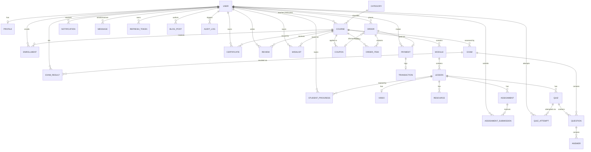

# Entity Relationship Diagram — Adavi Digital Institute LMS

Source of truth for the schema is `backend/prisma/schema.prisma`. Diagram below (Mermaid syntax — renders
on GitHub and most Markdown viewers).

## Relationship Notes

- **User → Profile**: 1:1. Auth identity separated from display/personal data.
- **User → Course (instructor)**: 1:N. A user with role `INSTRUCTOR` owns many courses.
- **Course → Module → Lesson**: strict hierarchy (1 course : N modules : N lessons), ordered by `order` field,
  matching the spec's `Module → Lessons → Videos/PDF/Slides → Resources → Assignment → Quiz → Completion`.
- **Lesson → Video**: 1:1 (a lesson references one primary video; PDFs/slides live in `Resource`).
- **Enrollment**: junction between `User` (student) and `Course`, unique per (student, course), carries
  `progressPc` and `status`.
- **StudentProgress**: junction between `User` and `Lesson`, tracks per-lesson watch position/completion —
  aggregated to compute `Enrollment.progressPc`.
- **Quiz/Exam → Question → Answer**: Question is shared (nullable FKs to either Quiz or Exam) supporting all
  6 question types (`QuestionType` enum) with `matchKey` supporting matching/drag-drop.
- **Order → OrderItem → Course**: supports multi-course cart checkout; `Order → Payment → Transaction`
  captures gateway raw payloads for reconciliation/audit.
- **Coupon**: optional link to a specific course or platform-wide; tracked via `usedCount`/`maxUses`.
- **Certificate**: issued per (student, course), unique `certificateNo`, `verificationUrl` for public
  verification, `digitalSignature` for tamper-evidence.
- **AuditLog**: nullable `userId` (system-triggered events allowed), generic `entity`/`entityId` pattern so
  any table can be audited without schema changes.
- **AIRecommendation**: stores generated recommendation payloads per student for caching/analytics.

## Multi-Tenant Ready
Every top-level owning table (`Course`, `Order`, `Category`, etc.) is structured so a nullable `tenantId`
column + `Tenant` table can be introduced in a single additive migration without breaking existing
relationships — required for the future SaaS expansion noted in the PRD.
